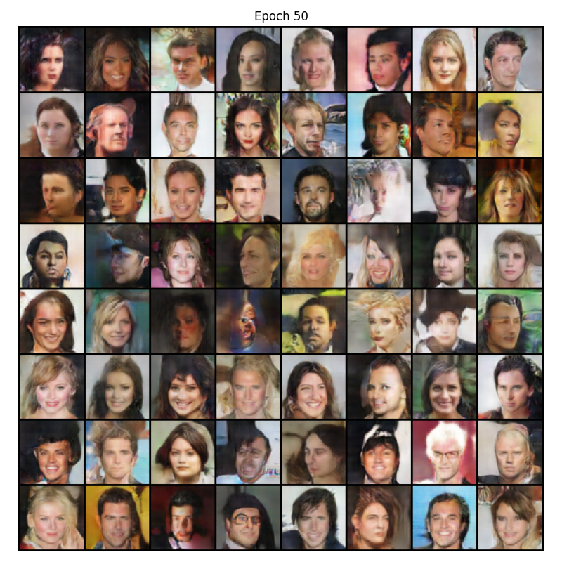
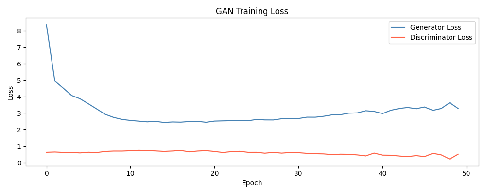

# Deep Convolutional GAN (DCGAN)

DCGAN introduces convolutional layers to the Generator and Discriminator, replacing the fully connected MLPs of the Vanilla GAN. This allows the model to learn spatial hierarchies and generate much higher quality, sharper images.

## Features
- Uses Convolutional and Transposed Convolutional layers.
- Batch Normalization in both Generator and Discriminator.
- LeakyReLU activations for the Discriminator and ReLU for Generator.

## Architecture

| Generator | Discriminator |
| :--- | :--- |
| `ConvTranspose2d (100 --> 512)`   BatchNorm, ReLU | `Conv2d (3 --> 64)`   LeakyReLU |
| `ConvTranspose2d (512 --> 256)`   BatchNorm, ReLU | `Conv2d (64 --> 128)`   BatchNorm, LeakyReLU |
| `ConvTranspose2d (256 --> 128)`   BatchNorm, ReLU | `Conv2d (128 --> 256)`   BatchNorm, LeakyReLU |
| `ConvTranspose2d (128 --> 64)`   BatchNorm, ReLU | `Conv2d (256 --> 512)`   BatchNorm, LeakyReLU |
| `ConvTranspose2d (64 --> 3)` (Output)   Tanh | `Conv2d (512 --> 1)` (Output)   Sigmoid |

## Outputs
Here are the generated faces after 50 epochs and the corresponding loss curve:

### Generated Images (Epoch 50)

### Loss Curve

## Observations

### Progression
- **Epoch 1**: Already recognizable faces with color, hair, and rough facial structure — Vanilla GAN took until epoch 10 to get here.
- **Epoch 5→10**: Sharpening rapidly, diverse skin tones, hair colors, and backgrounds emerging.
- **Epoch 25→50**: Faces are photorealistic at a glance. Individual samples have clear identity, lighting, expression variation. The MLP ceiling is completely gone.

### Training Dynamics & Red Flags
- At ending epochs, the Discriminator (D) is clearly dominating (loss around 0.3ish) with 0.22 at epoch 49.
- If we had ran 100 epochs, loss_D would collapse towards 0 and the Generator's (G) images would degrade, indicating instability.

### Interpretation of Loss
- `loss_G` settling at **~3.2-3.3** is higher than Vanilla GAN (~1.0) — which is counterintuitive.
- Higher `loss_G` means D is harder to fool, which means D is more capable. This means G is being pushed harder to improve.
- The better the D, the higher G's loss at equilibrium.

## Suggested Improvements
To combat the Discriminator dominance and stabilize training further:
- Add a Learning Rate (LR) scheduler.
- Apply Spectral Normalization on D.
- Train G twice per D step to balance the learning pace.
