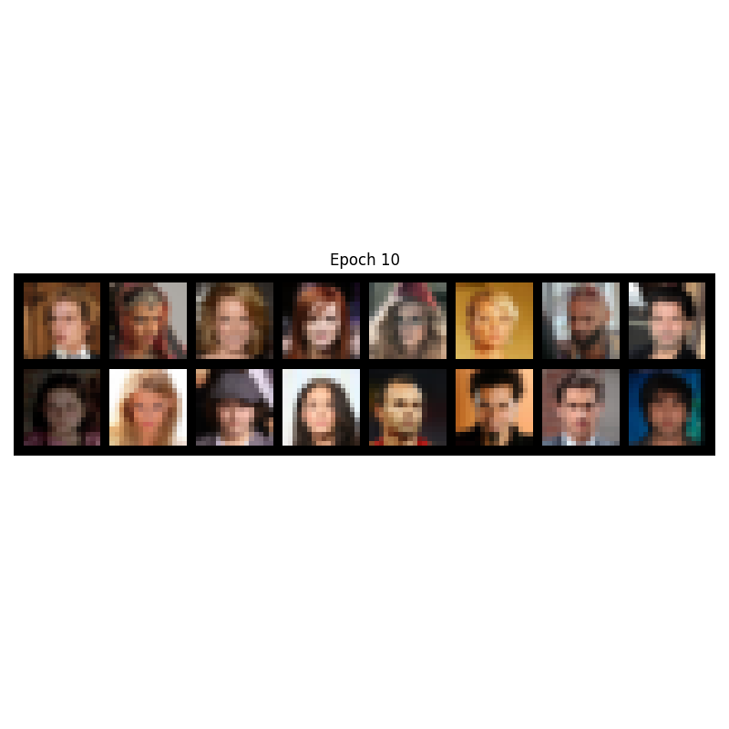
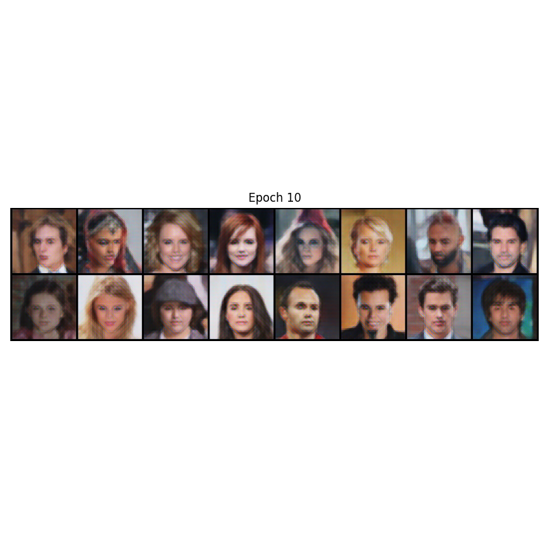
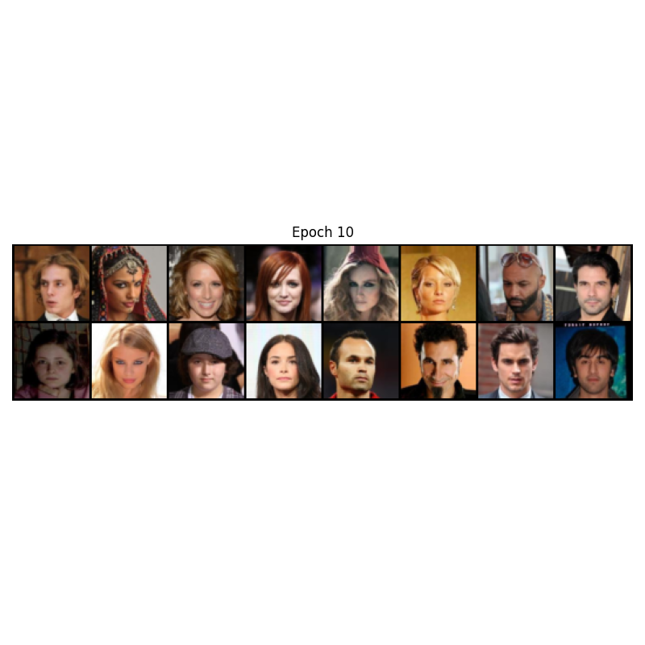

# Super-Resolution GAN (SRGAN)

SRGAN is designed to upscale low-resolution images into high-resolution images. It utilizes a perceptual loss function which consists of an adversarial loss and a content loss to recover photo-realistic textures from heavily downsampled images.

## Outputs
Here are the Low-Resolution (LR), High-Resolution generated (Fake HR), and original High-Resolution (Real HR) images from Epoch 10:

### Low Resolution Input

### Fake High Resolution (Generated)

### Real High Resolution (Target)

## Architecture

| Generator | Discriminator |
| :--- | :--- |
| `Conv2d (3 --> 64)`   PReLU | `Conv2d (3 --> 64)`   LeakyReLU |
| `16x ResidualBlocks`   (Conv2d, BN, PReLU, Conv2d, BN) | `Conv2d (64 --> 64)` (stride 2)   BN, LeakyReLU |
| `Conv2d (64 --> 64)`   BN | `Conv2d (64 --> 128)` (stride 1)   BN, LeakyReLU |
| `2x UpsampleBlocks`   (Conv2d, PixelShuffle, PReLU) | `Conv2d (128 --> 128)` (stride 2)   BN, LeakyReLU |
| `Conv2d (64 --> 3)` (Output)   Tanh | `Conv2d (128 --> 256)` (stride 1)   BN, LeakyReLU |
| | `Conv2d (256 --> 256)` (stride 2)   BN, LeakyReLU |
| | `Conv2d (256 --> 512)` (stride 1)   BN, LeakyReLU |
| | `Conv2d (512 --> 512)` (stride 2)   BN, LeakyReLU |
| | `AdaptiveAvgPool2d(1)`, `Flatten` |
| | `Linear (512 --> 1024)`   LeakyReLU |
| | `Linear (1024 --> 1)` (Output)   Sigmoid |

## Observations
This one fought back. 
16x16 → 64x64 super-resolution using perceptual loss (VGG feature maps) instead of pixel-wise MSE. The results by epoch 10 were already sharper than anything the previous phases produced.

But the Discriminator collapsed by epoch 2 in the first run. `loss_D` hit 0.0008. G was getting near-zero gradients. Classic D-dominance.

Two fixes that stabilized it:
- **Label smoothing**: `real_labels = 0.9` instead of `1.0`, so D can never become overconfident.
- **2x Generator updates per Discriminator step**: rebalancing the adversarial competition.

Documented the remaining instability honestly — the real fix is spectral normalization or switching to WGAN-GP entirely. That's the next iteration.

## Known Issue: Discriminator Instability
- **Problem:** `loss_D` collapses toward 0 by epoch 15-20
- **Symptom:** G loses adversarial gradient, sharpness nudge disappears
- **Partial fixes applied:**
  - Label smoothing (`real_labels = 0.9`)
  - 2x G updates per D step
- **Why it's still unstable:**
  - BCE + Sigmoid saturates at extremes, zero gradient at boundaries
- **Proper fixes (not implemented):**
  - Spectral normalization on D conv layers
  - Replace BCE with BCEWithLogitsLoss + no Sigmoid
  - Full fix: switch to WGAN-GP critic
