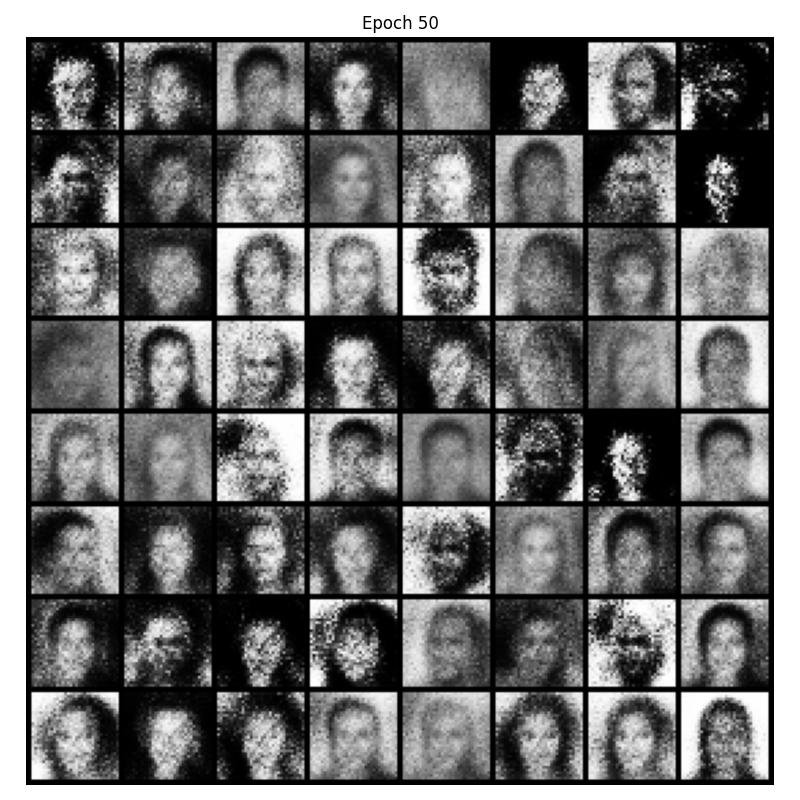
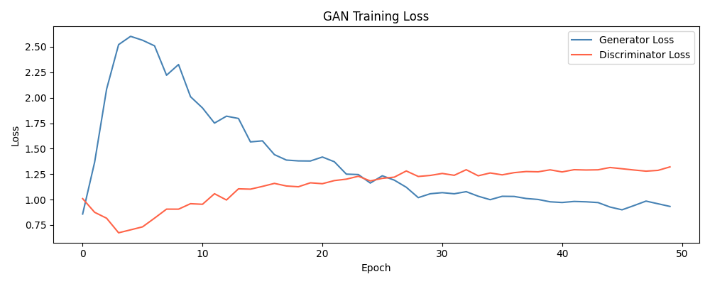

# Vanilla GAN (32x32 grayscale)

## Phase 1 Overview
- **Architecture**: MLP Generator + MLP Discriminator
- **Loss Function**: Binary Cross Entropy (BCE) Loss
- **Optimizer**: Adam
- **Goals**: Understand the training loop, witness the ceiling of MLP (Multi-Layer Perceptron)
- **Deliverable**: Generated faces that are recognizably face-shaped but terrible.

## Architecture

| Generator | Discriminator |
| :--- | :--- |
| `100 --> 256`   LeakyReLU | `1024 --> 512`   LeakyReLU |
| `256 --> 512`   LeakyReLU | `512 --> 256`   LeakyReLU |
| `512 --> 1024`   LeakyReLU | `256 --> 1` (Output)   Sigmoid |
| `1024 --> 1024` (Output)   Tanh | |

## Training Observations

1. **Epoch 1:** Pure noise. The Generator has no idea what a face is yet.
2. **Epoch 5:** Blobs emerging. G has learned that faces have a roughly centered bright region. No structure yet.
3. **Epoch 10:** Recognizable faces. Eyes, nose placement, oval face shape — all there. ***This is where the MLP hits its ceiling***.
4. **Epoch 25 to 50:** Little bit of improvement. Some faces are sharper, but the grid still has blurriness. The MLP cannot model spatial structure — every pixel is independent in its representation.

> That blurriness and inconsistency at epoch 50 is not a training failure. That is exactly the Vanilla GAN ceiling. `DCGAN` is meant to improve exactly that.

## Loss Curve Dynamics

The loss curve looks good and healthy:
- `loss_G` spikes early (epoch 1-5) — D is easily beating G initially.
- Both losses converge towards equilibrium around epoch 20-25.
- After epoch 25 they saturate — **`loss_D ~1.3`**, **`loss_G ~1.0`**.

`loss_D` hovering around 1.3 means D is uncertain but slightly favoring real.  
`loss_G` around 1.0 means G is genuinely fooling D roughly half the time.  

**This is the Nash equilibrium for BCE loss — both are stuck, neither can improve further.**  
> This architecture is at the bottleneck.

## Folder Structure
- `dataset.py`: Defines the CelebA dataset loading and preprocessing logic.
- `model.py`: Contains the Multi-Layer Perceptron (MLP) architecture for Generator and Discriminator.
- `train.py`: The training loop for Vanilla GAN.
- `test_wiring.py`: A script to test the model wiring and forward passes.
- `utils.py`: Helper functions for generating images and other utilities.

## Outputs
Here are the generated faces after 50 epochs and the corresponding loss curve:

### Generated Images (Epoch 50)

### Loss Curve

