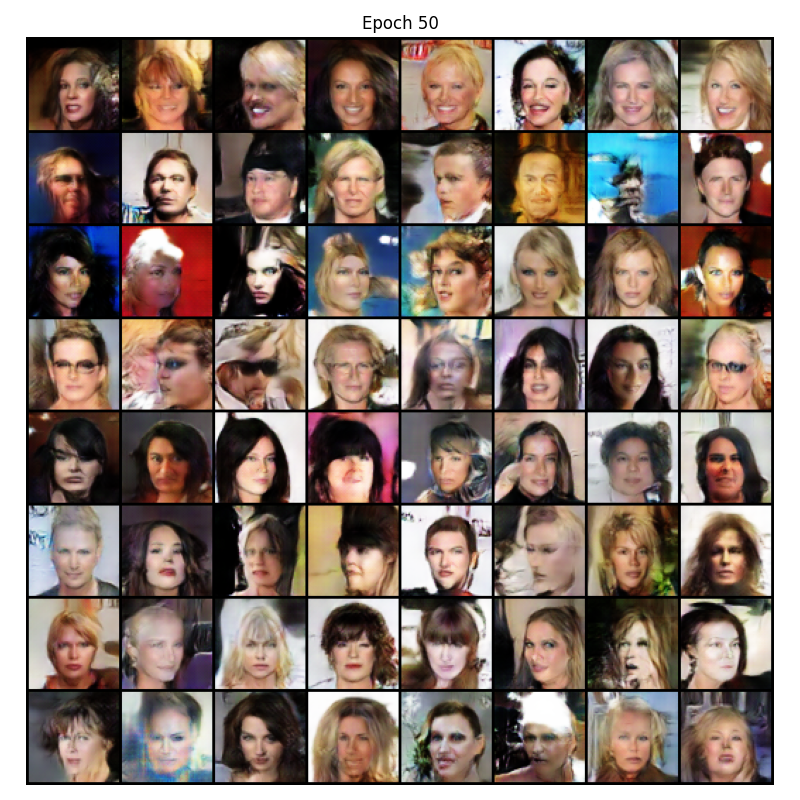
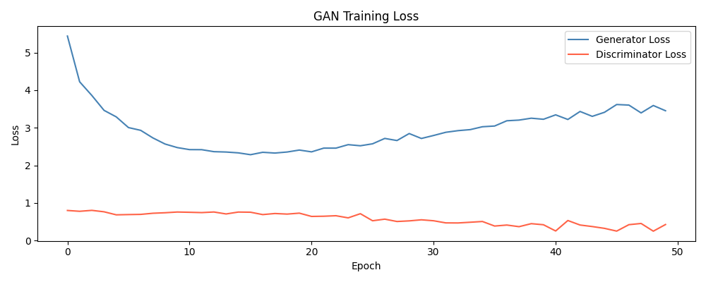

# Conditional GAN (cGAN)

Conditional GAN allows for targeted generation by conditioning both the Generator and the Discriminator on some extra information, such as class labels or attributes.

In this implementation, the model is conditioned on the following 5 attributes from the CelebA dataset:
- **Smiling**
- **Male**
- **Young**
- **Eyeglasses**
- **Black Hair**

## Architecture

| Generator | Discriminator |
| :--- | :--- |
| `ConvTranspose2d (100+5 --> 512)`   BatchNorm, ReLU | `Conv2d (3+5 --> 64)`   LeakyReLU |
| `ConvTranspose2d (512 --> 256)`   BatchNorm, ReLU | `Conv2d (64 --> 128)`   BatchNorm, LeakyReLU |
| `ConvTranspose2d (256 --> 128)`   BatchNorm, ReLU | `Conv2d (128 --> 256)`   BatchNorm, LeakyReLU |
| `ConvTranspose2d (128 --> 64)`   BatchNorm, ReLU | `Conv2d (256 --> 512)`   BatchNorm, LeakyReLU |
| `ConvTranspose2d (64 --> 3)` (Output)   Tanh | `Conv2d (512 --> 1)` (Output)   Sigmoid |

## Outputs
Here are the generated faces after 50 epochs and the corresponding loss curve:

### Generated Images (Epoch 50)

### Loss Curve

## Observations

### What's Working
- **Row 1 (Smiling)**: Visibly more teeth, upturned mouths — conditioning took hold.
- **Row 2 (Male)**: Broader faces, shorter hair, more masculine features — clearly distinguishable from other rows.
- **Row 4 (Eyeglasses)**: Several samples show visible glasses frames — this is the hardest attribute to condition on and it's partially there.
- **Row 3 (Young) and Row 5 (Black Hair)**: Less visually distinct. Young is hard because CelebA faces are already mostly young, so D never learned a strong Young vs Not-Young signal. Black Hair shows dark hair in several samples but inconsistently.
- **Image quality**: On par with DCGAN epoch 50 — conditioning added complexity without hurting realism. That's the correct tradeoff.

### Training Dynamics
- `loss_D` is showing the same late-stage decline as DCGAN - dropping to 0.25 at epochs 41, 46, 49.
- This is the same D-dominance pattern, slightly worse because D now has an easier job: it can reject fakes based on attribute mismatch alone, not just realism.

## Suggested Improvements
- **Label smoothing**: Instead of `real_labels = 1.0`, use `real_labels = 0.9` (Makes D's job harder and helps prevent D from becoming overconfident).
